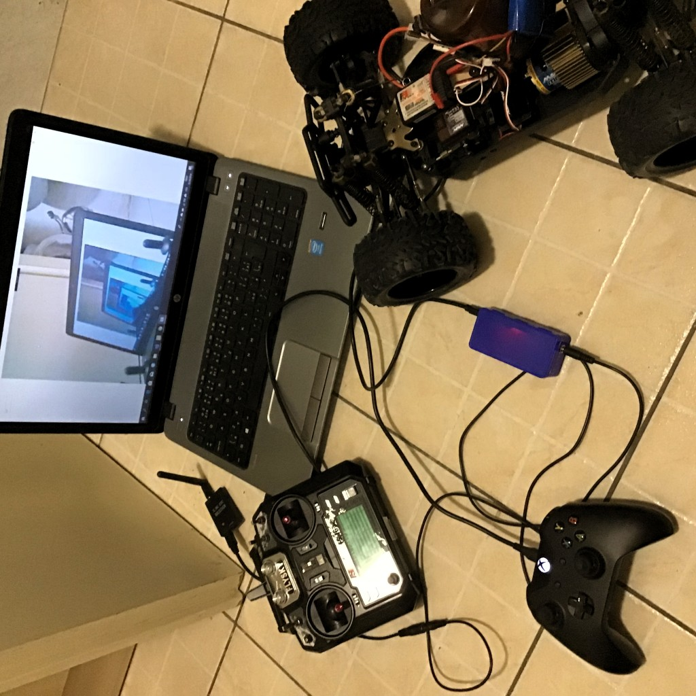

FPVRemote
---------

Control an FPV RC car using a computer with a Tobii eye tracker (or a gamepad). Works with Windows 10.

This project is heavily inspired by a TeamGleason [Pilot37 project](https://github.com/TeamGleason/Pilot37), using a less exotic, more available hobby RC and Arduino hardware.

